 🔌🔄

# 🐧 Linux Bash Ve Komutlarına Hızlı Başlangıç🚀
<p>Bu makale Linux işletim sisteminin temel shell komutlarını içermektedir. Dosya listeleme,Dizin değiştirme,dosya işlemleri gibi  önemli kodların detaylı kullanımını anlatmaktadır</p>


## Bash Sell Kısa Yollar
* `Ctrl + A` : İmleci satır başına götürür
* `Ctrl + E` : İmleci satır sonuna götürür
* `Ctrl + B` : İmleç bir karakter geri gider
* `Ctrl + F` : İmleç bir karakter ileri gider
* `Alt + B` : İmleç bir kelime geri gider
* `Alt + F` : İmleç bir kelime ileri gider
* `Ctrl + XX` : İmleç bulunduğu yer ile satır başı arasında gider gelir
* `Ctrl + L` : Ekranı temizler ve imleç en üst satıra çıkar (__clear__ komutu ile aynı)
* `Ctrl + U` : İmlecin solundaki herşeyi siler
* `Ctrl + K` : İmlecin sağındaki herşeyi siler
* `Esc + T` : İmleçten önceki iki kelimeyi yer değiştirir
* `Ctrl + D` : Terminali sonladırır (__exit__ komutu ile aynı)
* `Tab` : Otamatik tamamlama sağlar. Bu durum hem dosya/dizin hem de komutlar için geçerlidir
* `Ctrl + R` : Daha önce kullanılan komutlar arasında arama ve yeniden o komutu kullanma gibi işlemleri yapmanızı sağlar

## Birden Çok Konsol Açma
Linux sisteminde aynı anda birbirinden bağımsız oturumlarda çok sayıda konsol açıp bu konsollarda çalışabilir, eş zamanlı olarak __6__ ayrı konsol açıp hepsinde ayrı ayrı işlemler yapabilirsiniz. X oturumundan (grafiksel kullanıcı oturumu da denebilir) konsola geçiş yapmak için `<Ctrl + Alt><Fn>` __(n=1,...6)__ tuşları kullanılır. X oturumuna geri dönmek için de `Ctrl + Alt + F7` tuşları kullanılır. Evet F1-F6 arası tuşlarla 6 tane __sanal terminal__ açabiliyoruz. Eğer sistemde kullanılıyorsa `<Ctrl + Alt><Fn>` __(n=7,...12)__ ile de X sunucuları arasında geçiş yapılabilir


## Komut Satırında Aynı Anda Birden Fazla Komut Kullanımı
Terminalde/konsolda aynı anda birden fazla komut kullanabilirsiniz. Bunun için kullanacağınız komutları __noktalı virgül__ ile ayırmanız yeterlidir. Örneğin `ls;ls /etc` komutunun çıktısı aşağıdaki gibi olucaktır

```shell
ls;ls /etc
```

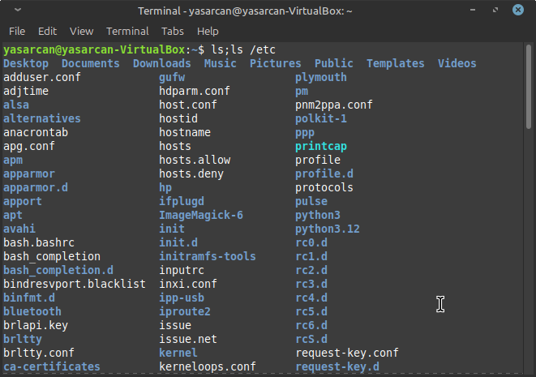

Terminalde birden fazla komut çalıştırmak && operatörü de kullanılabilir. Bu operatör sistem güncelleme sırasında çok kullanılır Örneğin `apt-get update && apt-get upgrade` komutu verildiğinde sırasıyla komutlar çalıştırılarak sistem güncellenecektir. Şimdi bir örnek yapalım ve `ls && cd /etc` komutunun ciktisina bakalim

```shell
ls && cd /etc
```

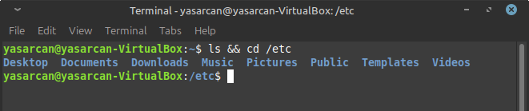

Bir diğer operatörümüzde `||` operatörümüzdür Terminalde iki komut kullanırken komutlar arasında bu operatörü koyarsak birinci komut başarısız olursa diğer komutu çalıştırmasını istediğimizi söylemiş oluruz. Örnek olarak `abc || cd /home` komutunu deneyelim 

```shell
abc || cd /home
```

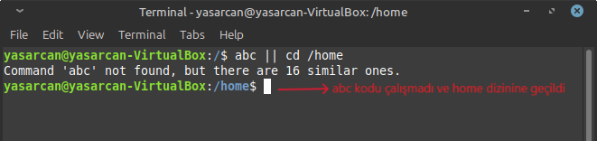

__Görüldüğü gibi burada ilk komutumuz çalıştırılamadığı içinjn ikinici komutumuz çalıştırıldı !!__ 

# Yardım Alma ve Man Klavuz Sayfaları
Linux sistemlerinde çok güçlü bir yardım alma sistemi vardır. Komut satırından kullanacağımız bir komutun kullanım kullanım argümanları ve parametrelriyle iligili ya da bir uygulamanın nasıl kullanılacağı ilgili geniş bir dökümantasyon yardımı vardır. Bu kısımda bunlar değineceğiz

## `help`
Daha sonra değineceğimiz __ls__ komutunun kullanımıyla ilgili bilgi almak için __ls --help__ komutunu kullanabilirsiniz 

```shell
ls --help
```

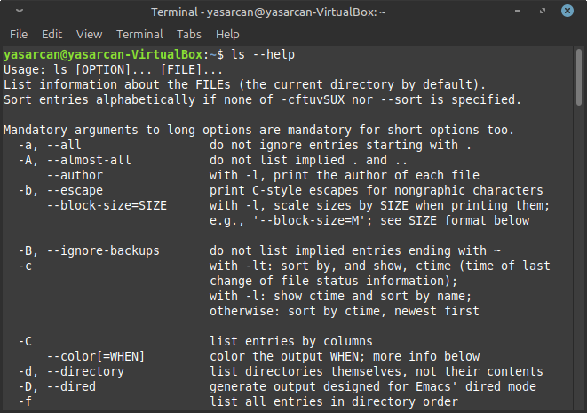

## `man`  (Manuel Pages)
Linux sistemde iç çeşit temel döküman ve bilgi kaynağı vardır:

* Kılavuz Sayfaları (__manuel pages__)
* Bilgi Sayfaları (__info pages__)
* Uygulamalar ile birlikte gelen ve __/usr/share/doc__ dizininde bulunan dökümanlardır

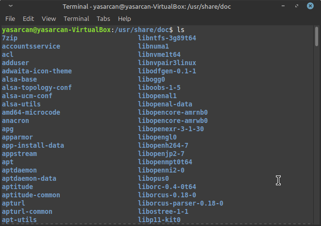

Man sayfaları Linux sistemde temel yardım alma dosyalarıdır Bir man sayfasının genellikle şu şekildedir

* `NAME` : Komutun ismi ve açıklamsı
* `SYNOPSIS` : Komutunun nasıl kullancağı
* `DESCRIPTION` : Komutunun fonksiyonu hakkında açıklama
* `EXAMPLE` : Komutunun nasıl kullanılacağı ilgili örnekler
* `SO ALSO` : İlgili Başlıklar

Kılavuz sayfaları __/usr/share/man__ altinda bulunur
```shell
cd /usr/share/man
```

```shell
ls
```

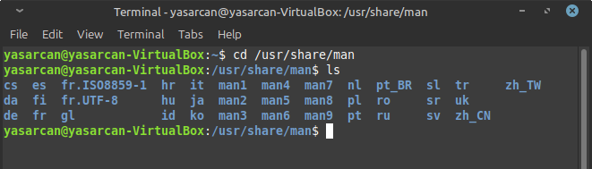

## `whatis`
Bize dolaylı yoldan yardım eden başka bir komut da __whatis__ komutudur. Bu komutu kullanarak bir uygulama ya da komutla ilgili yardımın hangi klavuz sayfalarında olduğunu öğrenebiliriz

```shell
whatis echo
```


# Bilgi Alma Komutları
Sistemimizde bulunan dosyalarla,programlarla, süreçlerle, kullanıcılarla vs.ilgili bilgi almak için birçok komut bulunmaktadır. Bu komutların neler olduğundan bahsedeceğiz

## `lsb_release`
**Linux Dağıtımının Adını Öğrenme**</br>
Kullandığınız Linux dağıtımın adını öğrenmek için __lsb_release -a__ komutunu kullanabiliriz

```shell
lsb_release -a
```
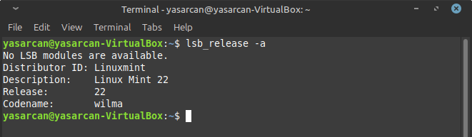

## `etc/issue`
**Linux Adı Öğrenme** </br>
Bu komut, kullandığınız Linux'ün adını görmek için kullanılır
```shell
cat /etc/issue
```
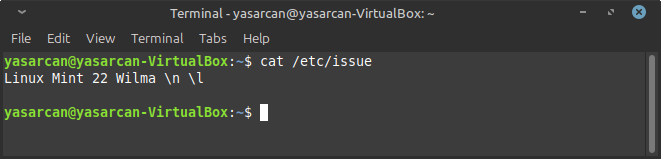

## `uname`
**Tam Versiyon Öğrenme** </br>
Sisteminizin kullandığı kernel versiyonunu öğrenmek için __uname -a__ komutunu kullanabilirsiniz

```shell
uname -a
```
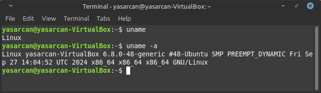

|Parametre  |Açıklama | 
|-----------|---------|
|`uname -n`  |Makinanın ağdaki adını gösterir|
|`uname -r`|Çekirdek sürümünü gösterir.|
|`uname -v`|Çekirdeğin yayınlanma tarihi ve saati gibi ayrıntılı sürüm bilgisini gösterir.|
|`uname -v`|Çekirdeğin yayınlanma tarihi ve saati gibi ayrıntılı sürüm bilgisini gösterir.|
|`uname -a`|Tüm bilgileri toplu olarak gösterir.|

</br>

## `cal`
**Takvim  Görüntüleme**</br>
Bulunduğumuz ayı sistemin bir aylık takvim olarak konsoldan göstermesi için __cal__ komutu kullanılır

```shell
cal
```
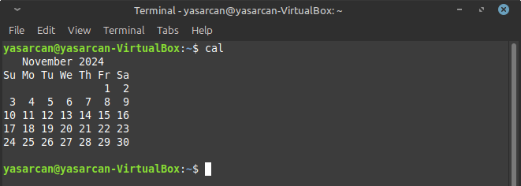 </br>

* `cal 7 2001` Komutu 2001 yılının  7. ayının takvimi verir
```shell
cal 7 2001
```
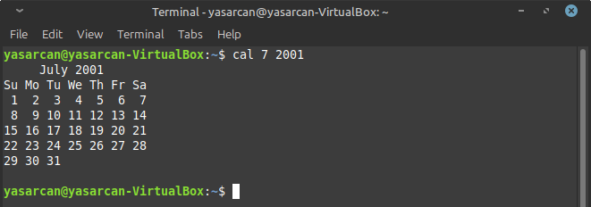 </br>

* `cal  2025` Belilrli bir yılla ilgili bir senelik takvimi görmek için de yandakine benzer bir komut kullanılabilir
```shell
cal 2025
```
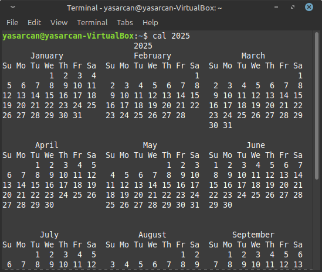 </br>

## 📅 `date`
**Saat ve Tarih Öğrenme** </br>
Sistemin o anki saat ve tarih bilgisi öğrenmek için __date__ komutu kullanılır
```shell
date
```
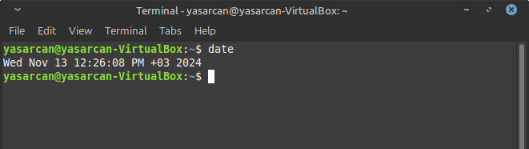 </br>

## `hostname`
**Bilgisayarın Adını Öğrenme** </br>
Kullandığınız sistemde bilgisayara verdiğimiz adıyani host adını görmek için __hostname__ komutunu kullanırız

```shell
hostname
```
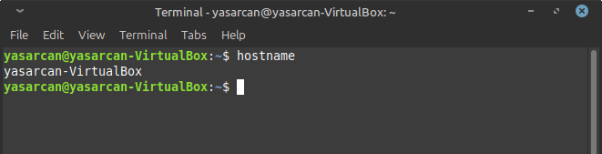 </br>

## `who-whoami`
**Sistemde Kimin Login Olduğunu Öğrenme** </br>
Sistemde kim aktif,kim login olmuş, o an hangi kimlike çalışıyoruz gibi bilgileri öğrenmek için __w, who, whoami, who am i__ komutlarını kullanabiliriz

```shell
w
```
```shell
whoami
```

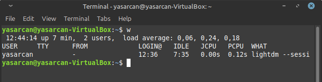 </br>

**Bu komutlarda ufak nüans farklılıkları vardır Fakat Kısaca**

|Komut  |Açıklama |
|-----------|---------|
|`w`  |Hangi kullanıcının o anda hangi uygulamayı/komutu çalıştırdığı bilgisi|
|`who`  |Sistemde hangi kimlikle çalışıldığı|
|`whoami`| Kullanıcın hangi kimlikle çalıştığını gösterir|

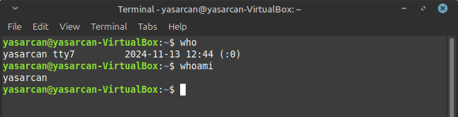 </br>

* `who  -b` who komutunun -b parametresi ile sestemin en son ne zaman açıldığı bilgisini görebiliriz

```shell
who -b
```

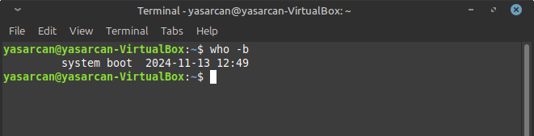 </br>


## `free`
**Kullanilan Bellek Miktarını Öğrenme** </br>
Bu komutla kullanilan bellek miktarı görülebilir __-m__ parametresiyle __free -m__ şeklinde kullanırsanız çıktı daha düzenli (MB) şeklinde olacaktır

```shell
free
```
```shell
free -m
```
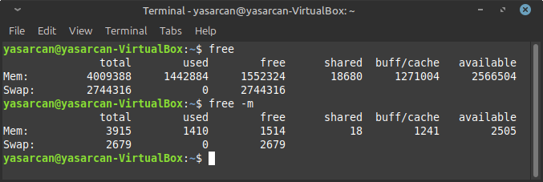 </br>

## `vmstat`
**Sistemin Genel Durumunu Öğrenme** </br>
Sisteminizin genel durumunu görmek için __vmstat__ komutunu kullanabiliriz

```shell
vmstat
```
 </br>


## `history`
**Yazılan Geçmiş Kodları Görme** </br>
Linux sistemlerinde kullanılan komutlar hafızada tutularak (Bu iş için ayrılan bir dosyaya belli sayıda yazılarak) daha sonrasında bu komutları tekarar görüntüleyebilirsiniz bu komutlar __.bash_history__ dosyasına kaydedilir. Daha yazılan bu komutlaru incelemek için __history__ komutunu kullanabilirsiniz. Bu komut .bash_history dosyasını referans alacaktır

```shell
history
```
 </br> </br> 

|Komut  |Açıklama |
|-----------|---------|
|`!215`  |Son yazılan 215.komutu (.bash_history dosyasında) tekrar çalıştırır|
|`!!`  |En son yazılan komutu tekrar çalıştırır|
|`!cat`| Daha önce yazılan cat komutunu gene aynı şekilde kullanarak tekrar çalıştırır|
|`!history 5`|En son yazılan 5 komutu listeler|

</br> 

# 🗂️ Dizin Klasörler Arasında Gezme Ve İçerik Listeleme ⌚
Dizinler arasında gezmek, içeriklerini listelemek, hangi dizinde çalıştığımızı görmek için kullandığımız komutlar vardır.
Bu kısımda size bu komutlardan bahsedeceğim

## `📁 pwd`
**Mevcut Dizin** </br>
Hangi dizinde çalıştığımızı görmek için __pwd__ komutunu kullanırız

```shell
pwd
```
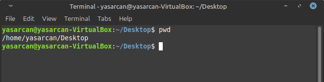

## `📂 cd`
**Dizin Değiştime** </br>
Evet anlaşılabileceği gibi __cd__ (change directory) komutu ile dizinler arasında geçiş yapabiliyoruz. Örneğin __cd user/share__ komutunu ile /share dizinine geçebiliriz.

```shell
cd
```
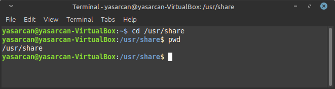

* `cd /` Komutunu kullanarak herhangi bir dizinden kök (__root__) dizinine geçiş yapabilirsiniz

```shell
cd /
```
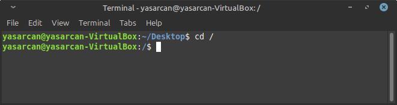

* `cd ..` Bir alt dizinden üst dizine geçmek istediğinizde ise (__cd ..__) komutunu kullanabilirsiniz. Eğer iki üst dizine geçmek istersek (__cd ../../__) şeklinde n sayıda üst dizine geçmek istersek te aynı örüntüde komutu yazarak geçiş yapabilirz

```shell
cd ..
```
```shell
cd ../home
```
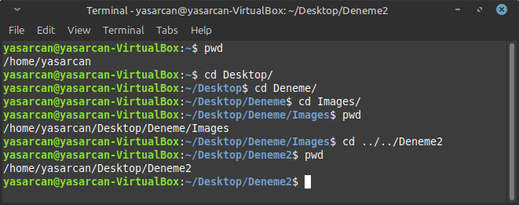

## 🖿  `ls`
**Alt Dizinleri Listeleme** </br>
Dizinler altında bulunan alt dizin, klasör ve dosyaalrı listelemek içim __ls__ komutu kullanılır. Parametresiz kullanılabildiği gibi bir çok özelliğie yarayan parametreli kullanımlarıda mevcuttur

```shell
ls
``` 
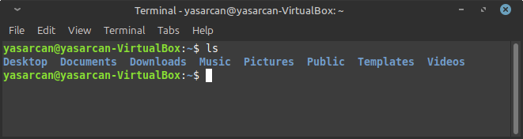

* `ls -l` -l parametresýle dosyalarin izinlerini, oluşturma tarihlerini vs. gibi  ayrıntılı bilgilerini görücek şekilde  listeleyebiliriz

```shell
ls -l
``` 

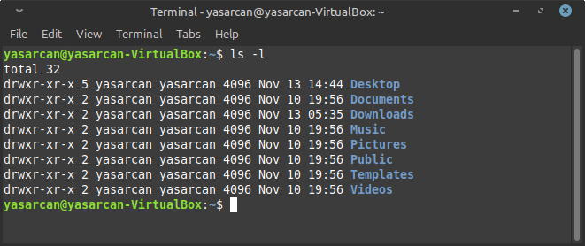


* `ls -la` -l -a parametreleriyle hem gizli dosyaları hemde normal dosyaları ayrıntılı bir şekilde görüntüleyebilirz

```shell
ls -la
``` 
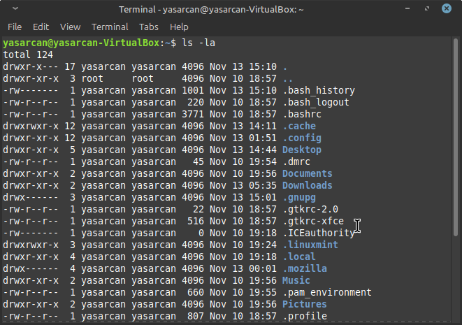

* `ls -1` Ekran çıktısının alt alt alt liste şeklinde çıkmasını isterseniz __-1__ parametresini kullanabilirsiniz

```shell
ls -1
``` 
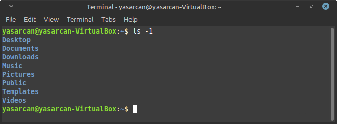

__Kullanabileceğiniz Diğer Parametreler__

|Komut  |Açıklama |
|-----------|---------|
|`ls -r`  |📋 Ekran çıktısını ters liste şeklinde gösterir|
|`ls -s`  |Dosya büyüklüğüne göre sıralar|
|`ls -i`| __inode__ (düğüm) numarası ile sıralar|
|`ls -lh`|Dosya boyutlarını daha okunaklı __(human readable)__ listeler|
|`ls -lt`|Dosyaları üzerinde yapılan değişiklik __(modifikasyon)__ tarihine göre listeler|

</br>
</br>


# 🗃️ Dosya İşlemleri 
<p>Bu bölümde dosya oluşturma, kopyalama, taşıma, içeriğini görüntüleme vs. gibi konulardan bahsedeceğim. Bu kısımda çalışacağımız dosyalar genellikle <strong>text</strong> (metin) dosyaalrı olucaktır</p>

## `touch`
**Dosya Oluşturma** </br>
Bir dosya oluşturmak için __touch__ komutu kullanılır. Örneğin `touch test.txt` komutu mevcut dizinde test adında bir txt (metin) dosyası oluşturacaktır. Burada dosayin sonuna .txt diyerek diyerek uzantsına verdik siz dilediğiniz türde dosya uzantısı vererek istenilen dosya türünü oluşturabilirsiniz </br>
_Not: Uzantısı verilmeyen dosyalar metin dosyası olarak kabul edilir_

```shell
touch test.txt
```

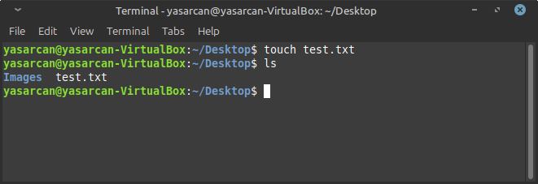

## `cat`
**Dosya İçeriğini Görüntüleme** </br>
Bir dosyanın içeriğini förüntülemek için __cat__ komutu kullanılır. Aşağıda daha önce içine `Hello World !` metni yazılmış bir metin dosyasının içeriği görüntülenmektedir

```shell
cat test.txt
```
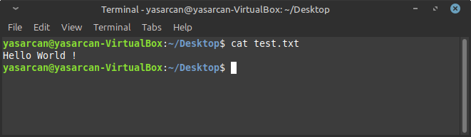

## `echo`
**Dosyalara Yazma** </br>
Bu komut dosya oluşturp içine istenilen string ifadenin yazılması için kullanılır 

```shell
echo "master of linux" > linuxshell
```

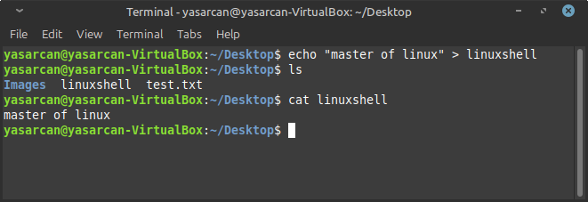

## `more`
**Dosyayi Terminalde Okuma** </br>
Metin dosyalarını terminalden okumak için kullanılan komutlardan biride __more__ komutudur. Bu komut daha çok komut çıktısınnın uzun olduğu durumlarda çıktıyı daha rajat okuyabilmek için kullanılır.Örneğin __more /etc/passwd__ kotunu verdiğimizde, uzun olan komut çıktısı ekrana gelir ve biz __enter__ tuşuna her bastığımızda satır satır ilerler,__space__ tuşu ilede sayfa sayfa ilerler. Bir önceki sayfaya dönmek için __b__ tuşu kullanılır. Çıkmak istediğimiz zamanda __q__
tuşuna basmamız yeterlidir

```shell
more /etc/passwd
```

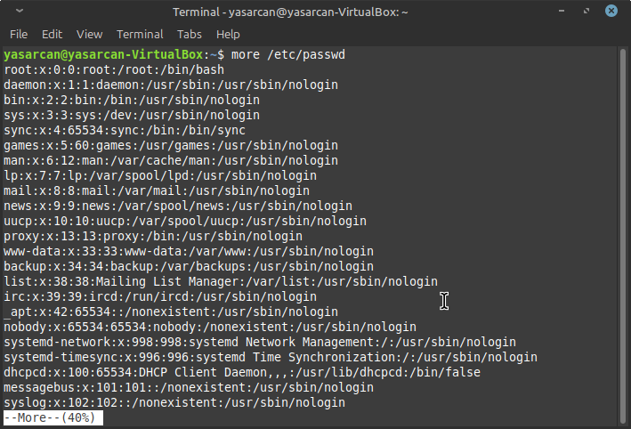


## `tac`
**Dosyayı Sondan başlayarak Yazma** </br>
Bir metin dosyasının içeriğini sondan başa doğru förmek için __tac__ komutu kullanılır

```shell
cat hacker && tac hacker
```
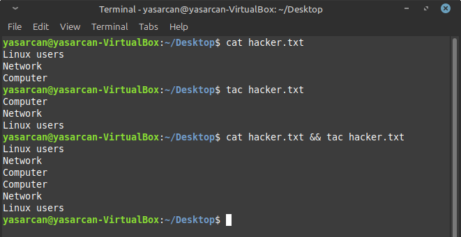

## `rev`
**Satırı Ters Çevirerek Yazma** </br>
İlginç bir komut olan rev komutu ile her satır ters çevrşlerek ekrana yansıtılır


```shell
rev hacker.txt
```
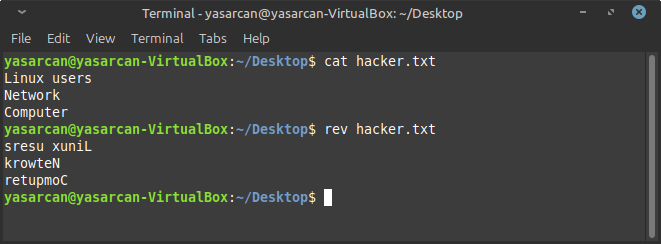

## `sort`
**Alfabetik Olarak Sıralama** </br>
Metin dosyasini/belge çıktısını terminale yansıtmak için __sort__ komutu kullanılır. Eğer __sort -r__ şeklinde kullanılırsa ters alfabetik olarak yansıtılır

```shell
sort
```

```shell
sort -r
```
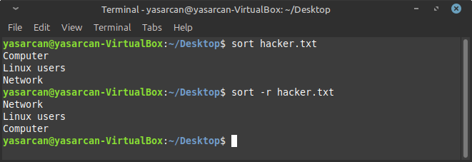

## `nl` 
**Satır Numaralandırılması** </br>
Bir dosyanın içeriğinde bulunan satırları numaranladırmak için __nl hacker__ kumutu kullanılır

```shell
nl
```
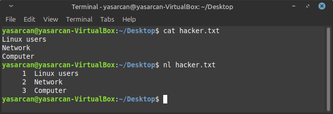

## `cmp`
**Dosyalar Arası Karşılaştırma** </br>
Dosyalar arasında karşılaştırmak için yapılan kullanılan bir diğer komutta __cmp__ koutudur. Örneğin __hacker.txt__ ve __test.txt__ adındaki iki dosyayı karşılaştırmak için __cmp hacker.txt test.txt__ kullanalım. Bu karşılaştırma sonucunda dosyaların farklarını, ilk farklılığın meydana geldiği satır ve byte numaraları şeklinde ekrana yansıtacaktır

```shell
cmp
```

```shell
cmp hacker.txt test.txt
```
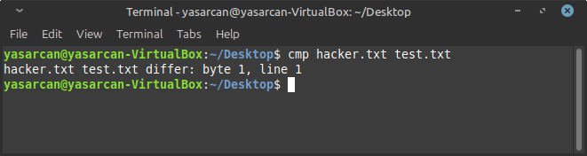

## `diff`
**Dosyalar Arası Farklılar Karşılaştırma**
Yine dosya karşılaştırmakta kullanılan bir komuttur. Eğer iki dosya arasında karşılaştırma yapılacaksa __diff__, üç dosya arasında karşılaştırma yapılacaksa __diff3__ kotu kullanılır.

```shell
diff
```
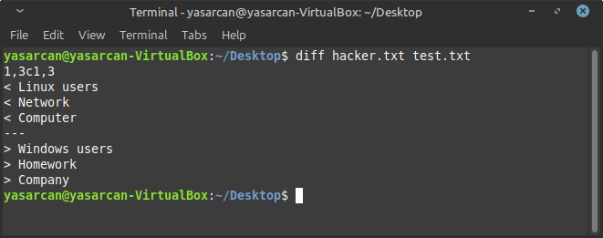

```shell
diff3 hacker.txt test.txt linuxshell
```
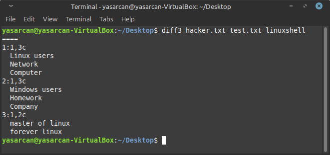

## `find`
Zaman zaman adının yalnızca bir kısmını bildiğiniz ama bulunduğu dizini bir türlü hatırlayamadığınız dosyalar ve dizinler olacaktır. Bu dosyaları bulmak ve bunlarla ilgili çeşitli işlemler yapmak için __find__ komutu kullanılır Kullanın kalıbı __find [dosya_yolu] [aranacak_ifade]__ şeklindedir. Yani ilk önce hangi dizinde arama yapacaksak onu belirtiyoruz daha sonra da arama yapcağımnız ifadeyi __-name__ ile belirtiyoruz.
Örneğin /__etc__ dizini altındaki __conf__ dosyalarını listelemek için __find /etc -name *.conf__ komutunu kullanabiliriz

```shell
find /etc -name *.conf
```


## 👇Dosya Taşıma-Kopyalama-Silme

Linux sistemde dosyaları __kopyalamak__ve __taşımak__ için kullandığımız iki temel komut vardır. Bunlar __cp__ ve __mv__ komutlarıdır. Kopylama işlemi için cp, taşıma işlemi için de mv kullanılır. Bu bölümde tüm dosya taşıma, kopyalama, silme işlemlerinde bahsedilecektir

## `cp`
__Dosya Kopyalama__ </br>
Kopyalama kotu olan __cp__ komutunun kullanımı __cp [kaynak] [hedef] şeklindedir__

```shell
cp [kaynak] [hedef]
```

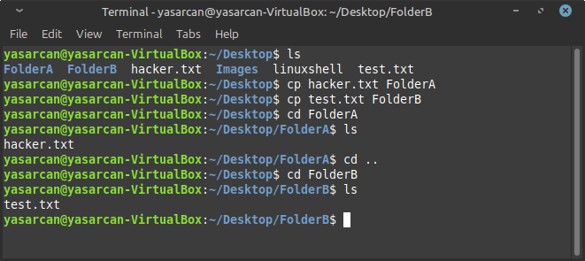

 * `cp -i` Eğer dikkatli biri olmadiğini düşünüyorsanız __cp__ komutunu __-i__ parametresi ile birlikte kullanabilirsiniz. Bu parametre hedef dizinde aynı doya varsa üzerine yazmadan önce sizlere uyarı mesahı verir (__interactive__). Onay verirseniz üstene yazarak kopyalar

```shell
cp -i
```
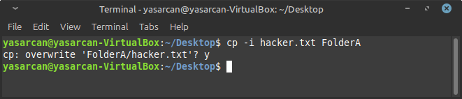

## `mv`
**Dosya Taşıma** </br>
Dosya taşımak için __mv__ komutu kullanılır. Komutun kullanımı cp komutunun kullanım şekli ile aynıdır

```shell
mv [kaynak] [hedef]
```
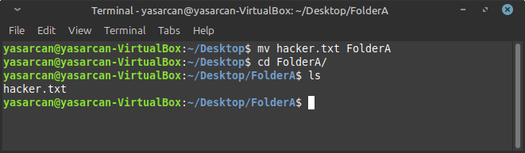

## `rm`
**Dosya ve Dizin Silme** </br>
Dosya dizin silme işlemlerinde kullanılan komut __rm__ komutudur. Bu komutla tek bir dosya silebileceğimiz gibi çok sayıda dosyayıda bir seferde silebiliriz

```shell
rm
```
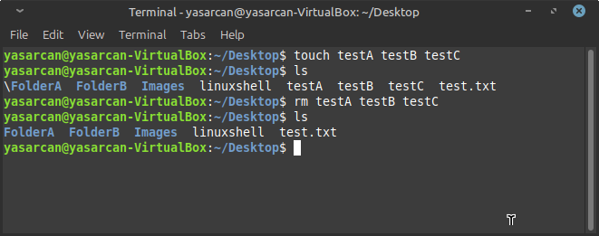 </br></br>

# 📁 Dizin Oluşturma ve Silme
<p>Dizin oluşturma ve silme işlemleri için iki komut kullanılır. Bunlar <strong>mkdir</strong> ve <strong>rm</strong> komutlarıdır</p>

## `mkdir`
**Dizin Oluşturma** </br>
En basit haliyle örneğin __deneme1__ adında bir dizin oluşturmak için __mkdir deneme1__ komutunu kullanabiliriz

```shell
mkdir
```
```shell
mkdir deneme1
```

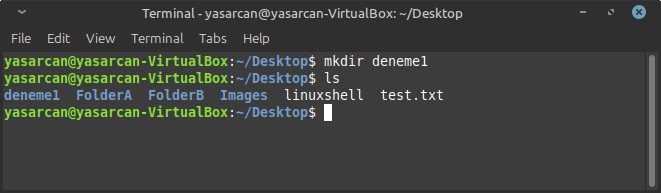

- 🗂️ Birden fazla dizin olıuşturmak için aşağıdaki gibi dizinleri peş peşe sıralayabilirsiniz

```shell
mkdir deneme2 deneme3
```


- `mkdir -p` parametresi bir dizin oluşturulurken alt dizinlerinide oluşturmamızı sağlar

```shell
mkdir -p
```
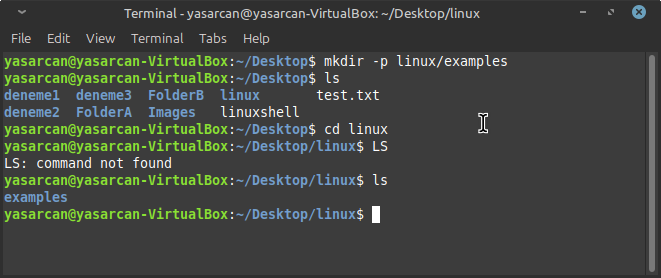

## `rm` 
**Dizin Silme İşlemleri**</br>
Linux'ta rm komutu, dosya ve dizinleri sistemden kalıcı olarak kaldırmak için kullanılan bir silme komutudur. Birden fazla alabildiği parametreler ile çeşitli silme işlemleri yapılabildiği gibi bu bu kaldırma işlemlerin geri alınamaz olduğuda bilinmelidir

```shell
rm
```
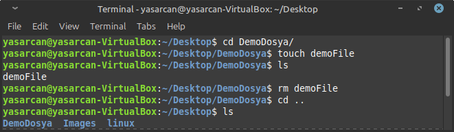

- `rm` kontunun aldığı parametreler ve işlevleri aşağıdaki tabloda detaylı anlatılmıştır

|Komut  |Açıklama |
|-----------|---------|
|`rm -i`  | __-i :__  Silme işlemi için kullanıcıya her dosya için onay sorar. Bu, yanlışlıkla dosya silme riskini azaltır.|
|`rm -f`  | __-f :__  Zorla (force) silme işlemi yapar. Dosya kullanıcı tarafından yazılabilir olmasa bile onay istemeden siler. Kullanıcıdan onay alınmadan silme işlemi yapılır.|
|`rm -r`| __-r :__ veya -R: Dizinleri ve altındaki tüm dosya ve alt dizinleri (recursive olarak) siler. Dizini tamamen kaldırmak için bu parametre kullanılır.|
|`rm -rf`|Bu komut,  /dizin_adi dizinini ve içindeki tüm dosya ve alt dizinleri, silme izni sormadan kalıcı olarak siler. Bu yüzden çok tehlikelidir ve dikkatli kullanılması gerekir|

</br>
</br>

__Not:__ Bu parametreler kendi başlarına kullanıldığı gibi birliktede kullanılabilmektedir rm -rf gibi lankin  -r -f parametreleri birlikte kullanıldıklarında geri dönülemez silme işlemleri yaptığı için kullanılırken ayriyetten dikkatli olunmalıdı. Bu parametlerin birlikte kullanılmasını dair bir kaç örnek

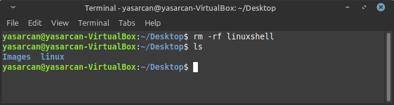 
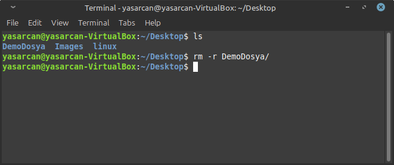 🔓
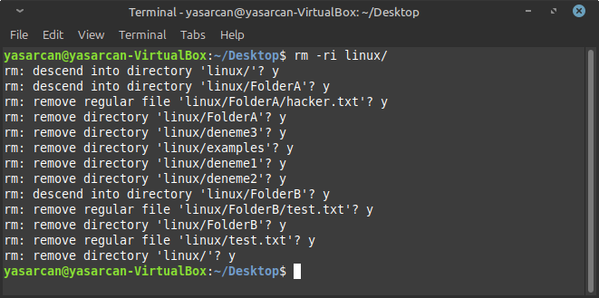 

</br>
</br>
</br>

# 🔐 Dosya ve Dizinlere Erişim Yetkileri 
Linux'ta dosya ve dizinlerle ilgili güçlü bir __güvenlik__ sistemi vardır. Bu güvenlik sisteminin en önemli unsuru da kullanıcıların hangi dosya ya da dizinde hangi yetkilere sahip olacaklarının iyi belirlenmesidir. Bi- lindiği gibi sistemdeki en yetkili kullanıcı __root__ kullanıcıdır ve bu kul lanıcı için herhangi bir kısıtlama yoktur. Bu sebeple eğer sistemde root kullanıcı haklarıyla çalışıyorsanız yapacağınız işlemlere dikkat etme- niz faydanıza olacaktır.
 


## Erişim Yetkileri

Sistemde bulunan her kullanıcı, kendisine verilen yetkiler çerçevesin- de işlemler yapabilir. Kullanıcılar bir dosya ya da dizinle ilgili üç fark- lı eylemde bulunabilirler:

* __okuma (r):__ Dosya içeriğini görebilir mi? (Klasörler için) Dosya listesini alabilir mi ?
* __yazma (w):__ Dosyaya yazma ve ayni zamanda dosyayi silme izni.(Klasörler için) Bu klasörler dosya veya alt klasör oluşturulabilir mi ?

* __çalıştırma (x):__ Dosyayı çalıştırabilir mi ? (Klasörler için) Bu klasöre geçebilir mi ? 

Şimdi bulunduğumuz dizinin içeriğini listelemek için __ls -l__ komutunu kullanalım ve listelenen alt dizin ve dizin ve dosyalarla ilgili izin durumlarına bakalım 

 

Listeyi inceledeğimizde __drwxr-xr-x__ ifadesini görüyorsunuz. bu kmodlama ifadeleri, listelenen dosya/dizinlerin kullanıcılar için geçerli erişim yetkilerini gösteren ifadelerdir. İfadenin başında gördüğünüz __d__ harfi bunun bir dizin (directory) olduğunu gösterir eğer başında __-__ işareti olsaydı bununda bir dosya olduğunu bize anlatırdı geriye kalan ve __9__ karakterden oluşan __rwxr-xr-x__ kodlamasını üçerli gruplara ayıralım Yani; </br> </br>

Birinci üçlü gurup (rwx) dosya/dizin __sahibinin__ yetkilerini, ikinci grup (r-x) __dosyanın sahibiyle aynı grupta__ bulunan kullanıcıların yetkilerini, üçüncü grup (r-x) ise __diğer__ (genel) kullanıcıların yetkilerini ifade eder.

- `r` : okuma yetkisi (__read__)
- `w` : okuma yetkisi (__write__)
- `x` : okuma yetkisi (__execute__)

Şimdi rwxr-xr-x ifadesine tekrar bakalım. Önce ifadeyi rwx r-x r-x şeklinde üç grupta düşünelim 

__rwx :__ Dosyanın sahibinin okuma, yazma ve çalıştırma yetkileri var

__r-x :__ Dosyanın sahibiyle aynı  grupta bulunan kullanıcıların okuma ve çalıştırma yetkileri var

__r-x :__ Diğer kullanıcıların okuma ve çalıştırma yetkileri var🌐 📄

## 📑 Erişim Yetkilerinin Değiştirilmesi
Bir dosya ya da dizinin erişim yetkilerininm değiştirilme işlemi sadece __root__ kullanıcı tarafından yapılabilir. Erişim yetkilerinin değiştirilmesi için __chmod__ (change mod) komutu kullanılır. Bu komutun kullanım kalıbı şöyledir : __chmod <ugoa> <+=-> <rwxst> <dosya_dizin>__

- `u` : Dosya ya da dizin sahibi (user)
- `g` : Dosya ya da dizin sahibiyle aynı grupta bulunan kullanıcılar (group)
- `o` : Diğer kullanıcılar (others)
- `a` : Herkes (all)
- `+` : Yetki ekleme
- `-` : Yetki çıkarma
- `=` : Yetki eşitleme
- `r` : Okuma yetkisi
- `w` : Yazma yetkisi
- `x` : Çalıştırma yetkisi

Birkaç örnek kullanıma bakalım :

    chmod + r <dosya_ismi> (Herkese okuma izni vermek)
    chmod u + rwx <dosya_ismi> (Dosyanın sahibine tüm yetkileri vermek)
    chmod o - wx <dosya_ismi> (Diğer kullanıcıların tüm okuma ve yazma haklarını kaldırmak)
    chmod o - wx <dosya_ismi> (Diğer kullanıcıların tüm okuma ve yazma haklarını kaldırmak)

