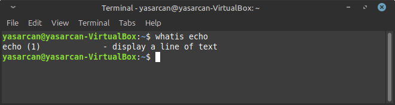

# 🐧 Linux Bash Ve Komutları ve Hızlı Başlangıç🚀
<p>Bu makale Linux işletim sisteminin temel shell komutlarını içermektedir. Dosya listeleme,Dizin değiştime,dosya işlemleri gibi  önemli kodların detaylı kullanımını anlatmaktadır</p>


## Bash Sell Kısa Yollar
* `Ctrl + A` : İmleci satır başına götürür
* `Ctrl + E` : İmleci satır sonuna götürür
* `Ctrl + B` : İmleç bir karakter geri gider
* `Ctrl + F` : İmleç bir karakter ileri gider
* `Alt + B` : İmleç bir kelime geri gider
* `Alt + F` : İmleç bir kelime ileri gider
* `Ctrl + XX` : İmleç bulunduğu yer ile satır başı arasında gider gelir
* `Ctrl + L` : Ekranı temizler ve imleç en üst satıra çıkar (__clear__ komutu ile aynı)
* `Ctrl + U` : İmlecin solundaki herşeyi siler
* `Ctrl + K` : İmlecin sağındaki herşeyi siler
* `Esc + T` : İmleçten önceki iki kelimeyi yer değiştirir
* `Ctrl + D` : Terminali sonladırır (__exit__ komutu ile aynı)
* `Tab` : Otamatik tamamlama sağlar. Bu durum hem dosya/dizin hem de komutlar için geçerlidir
* `Ctrl + R` : Daha önce kullanılan komutlar arasında arama ve yeniden o komutu kullanma gibi işlemleri yapmanızı sağlar

## Birden Çok Konsol Açma
Linux sisteminde aynı anda birbirinden bağımsız oturumlarda çok sayıda konsol açıp bu konsollarda çalışabilir, eş zamanlı olarak __6__ ayrı konsol açıp hepsinde ayrı ayrı işlemler yapabilirsiniz. X oturumundan (grafiksel kullanıcı oturumu da denebilir) konsola geçiş yapmak için `<Ctrl + Alt><Fn>` __(n=1,...6)__ tuşları kullanılır. X oturumuna geri dönmek için de `Ctrl + Alt + F7` tuşları kullanılır. Evet F1-F6 arası tuşlarla 6 tane __sanal terminal__ açabiliyoruz. Eğer sistemde kullanılıyorsa `<Ctrl + Alt><Fn>` __(n=7,...12)__ ile de X sunucuları arasında geçiş yapılabilir


## Komut Satırında Aynı Anda Birden Fazla Komut Kullanımı
Terminalde/konsolda aynı anda birden fazla komut kullanabilirsiniz. Bunun için kullanacağınız komutları __noktalı virgül__ ile ayırmanız yeterlidir. Örneğin `ls;ls /etc` komutunun çıktısı aşağıdaki gibi olucaktır

```shell
ls;ls /etc
```


Terminalde birden fazla komut çalıştırmak && operatörü de kullanılabilir. Bu operatör sistem güncelleme sırasında çok kullanılır Örneğin `apt-get update && apt-get upgrade` komutu verildiğinde sırasıyla komutlar çalıştırılarak sistem güncellenecektir. Şimdi bir örnek yapalım ve `ls && cd /etc` komutunun ciktisina bakalim

```shell
ls && cd /etc
```


Bir diğer operatörümüzde `||` operatörümüzdür Terminalde iki komut kullanırken komutlar arasında bu operatörü koyarsak birinci komut başarısız olursa diğer komutu çalıştırmasını istediğimizi söylemiş oluruz. Örnek olarak `abc || cd /home` komutunu deneyelim 

```shell
abc || cd /home
```


__Görüldüğü gibi burada ilk komutumuz çalıştırılamadığı içinjn ikinici komutumuz çalıştırıldı !!__ 

# Yardım Alma ve Man Klavuz Sayfaları
Linux sistemlerinde çok güçlü bir yardım alma sistemi vardır. Komut satırından kullanacağımız bir komutun kullanım kullanım argümanları ve parametrelriyle iligili ya da bir uygulamanın nasıl kullanılacağı ilgili geniş bir dökümantasyon yardımı vardır. Bu kısımda bunlar değineceğiz

## `help`
Daha sonra değineceğimiz __ls__ komutunun kullanımıyla ilgili bilgi almak için __ls --help__ komutunu kullanabilirsiniz 

```shell
ls --help
```


## `man`  (Manuel Pages)
Linux sistemde iç çeşit temel döküman ve bilgi kaynağı vardır:

* Kılavuz Sayfaları (__manuel pages__)
* Bilgi Sayfaları (__info pages__)
* Uygulamalar ile birlikte gelen ve __/usr/share/doc__ dizininde bulunan dökümanlardır


Man sayfaları Linux sistemde temel yardım alma dosyalarıdır Bir man sayfasının genellikle şu şekildedir

* `NAME` : Komutun ismi ve açıklamsı
* `SYNOPSIS` : Komutunun nasıl kullancağı
* `DESCRIPTION` : Komutunun fonksiyonu hakkında açıklama
* `EXAMPLE` : Komutunun nasıl kullanılacağı ilgili örnekler
* `SO ALSO` : İlgili Başlıklar

Kılavuz sayfaları __/usr/share/man__ altinda bulunur
```shell
cd /usr/share/man
```

```shell
ls
```


## `whatis`
Bize dolaylı yoldan yardım eden başka bir komut da __whatis__ komutudur. Bu komutu kullanarak bir uygulama ya da komutla ilgili yardımın hangi klavuz sayfalarında olduğunu öğrenebiliriz

```shell
whatis echo
```



# Bilgi Alma Komutları
Sistemimizde bulunan dosyalarla,programlarla, süreçlerle, kullanıcılarla vs.ilgili bilgi almak için birçok komut bulunmaktadır. Bu komutların neler olduğundan bahsedeceğiz

## `lsb_release`
**Linux Dağıtımının Adını Öğrenme**</br>
Kullandığınız Linux dağıtımın adını öğrenmek için __lsb_release -a__ komutunu kullanabiliriz

```shell
lsb_release -a
```


## `etc/issue`
**Linux Adı Öğrenme** </br>
Bu komut, kullandığınız Linux'ün adını görmek için kullanılır
```shell
cat /etc/issue
```


## `uname`
**Tam Versiyon Öğrenme** </br>
Sisteminizin kullandığı kernel versiyonunu öğrenmek için __uname -a__ komutunu kullanabilirsiniz

```shell
uname -a
```


|Parametre  |Açıklama |
|-----------|---------|
|`uname -n`  |Makinanın ağdaki adını gösterir|
|`uname -r`|Çekirdek sürümünü gösterir.|
|`uname -v`|Çekirdeğin yayınlanma tarihi ve saati gibi ayrıntılı sürüm bilgisini gösterir.|
|`uname -v`|Çekirdeğin yayınlanma tarihi ve saati gibi ayrıntılı sürüm bilgisini gösterir.|
|`uname -a`|Tüm bilgileri toplu olarak gösterir.|

</br>

## `cal`
**Takvim  Görüntüleme**</br>
Bulunduğumuz ayı sistemin bir aylık takvim olarak konsoldan göstermesi için __cal__ komutu kullanılır

```shell
cal
```
 </br>

* `cal 7 2001` Komutu 2001 yılının  7. ayının takvimi verir
```shell
cal 7 2001
```
 </br>